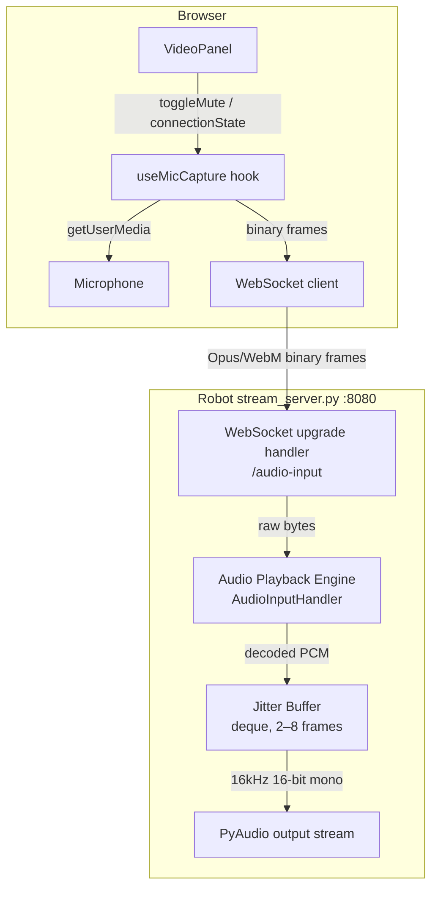

# Design Document: Doctor-to-Robot Audio

## Overview

This feature adds a bidirectional audio channel to the Chansey Care telehealth system. The existing system already streams audio and video from the robot to the doctor's browser (robot → browser). This design covers the reverse direction: the doctor's microphone audio is captured in the browser, transmitted over a WebSocket to the robot, and played back through the robot's speaker so the patient can hear the doctor.

### Key design decisions

- **Transport: raw WebSocket on port 8080** — the existing `stream_server.py` already owns port 8080 and handles the robot→browser audio stream. Adding a WebSocket upgrade handler to the same server avoids opening a new port and keeps all media traffic on one connection point.
- **Codec: Opus/WebM via `MediaRecorder`** — the browser's `MediaRecorder` API produces Opus/WebM natively with no additional dependencies. The robot decodes with `pyav` (FFmpeg bindings), which handles WebM container parsing and Opus decoding in one call.
- **Single-client enforcement** — only one doctor can be in a session at a time, so the server rejects a second WebSocket connection with close code 1008 rather than multiplexing.
- **Starts muted** — the hook initialises with `isMuted = true` so the doctor must explicitly unmute before audio is transmitted. This prevents accidental audio leakage on connect.
- **Jitter buffer** — a small in-memory queue (2–8 frames) on the robot smooths over network timing variations before handing PCM to PyAudio.
- **New hook `useMicCapture`** — rather than extending `useAudioSocket` (which handles robot→browser playback), a separate hook keeps the two directions independent and avoids coupling their lifecycle.

---

## Architecture

```mermaid
sequenceDiagram
    participant B as Browser (Doctor)
    participant WS as Robot WS Server<br/>(stream_server.py :8080/audio-input)
    participant JB as Jitter Buffer
    participant PA as PyAudio Output

    B->>B: getUserMedia() → MediaStream
    B->>WS: WebSocket connect ws://robot:8080/audio-input
    WS-->>B: 101 Switching Protocols
    B->>B: MediaRecorder(stream, {mimeType: 'audio/webm;codecs=opus'})
    loop Every ≤250 ms (while unmuted)
        B->>WS: binary frame (Opus/WebM chunk)
        WS->>JB: decode → PCM frames
        JB->>PA: drain when ≥2 frames buffered
    end
    B->>WS: WebSocket close
    WS->>JB: drain remaining frames
    JB->>PA: stop
```



---

## Components and Interfaces

### 1. `Robot_WS_Server` — WebSocket upgrade in `stream_server.py`

The existing `StreamHandler.do_GET` is extended to handle WebSocket upgrade requests on the path `/audio-input`. Python's stdlib `http.server` does not include a WebSocket implementation, so the upgrade handshake (RFC 6455) is implemented directly: parse `Sec-WebSocket-Key`, compute the accept hash, send the 101 response, then enter a frame-reading loop.

**New path in `StreamHandler.do_GET`:**
```python
elif path == "/audio-input":
    self._serve_audio_input()
```

**`_serve_audio_input()` responsibilities:**
- Perform the RFC 6455 handshake (101 Switching Protocols).
- Check the module-level `_audio_input_client_lock` — if a client is already connected, send close frame with code 1008 and return.
- Acquire the lock, set `_audio_input_active = True`.
- Enter a frame-reading loop: read WebSocket frames, extract binary payload, pass to `AudioInputHandler.on_frame(data)`.
- On disconnect (any reason): release the lock, set `_audio_input_active = False`, call `AudioInputHandler.on_disconnect()`.
- On unrecoverable error: log, send close frame, release lock, return (do not raise — keeps the server alive).

**Module-level state added to `stream_server.py`:**
```python
_audio_input_active: bool = False
_audio_input_lock: threading.Lock = threading.Lock()
```

### 2. `AudioInputHandler` — decode + jitter buffer + playback

A new class in `stream_server.py` (or a separate `audio_input.py` imported by `stream_server.py`).

```python
class AudioInputHandler:
    JITTER_MIN = 2          # frames before starting playback
    JITTER_MAX = 8          # frames before dropping oldest
    SILENCE_TIMEOUT = 0.5   # seconds — gap treated as silence
    OUTPUT_RATE = 16_000
    OUTPUT_WIDTH = 2        # int16
    OUTPUT_CHANNELS = 1

    def __init__(self, pa_instance: pyaudio.PyAudio | None): ...
    def on_frame(self, data: bytes) -> None: ...   # called from WS thread
    def on_disconnect(self) -> None: ...           # drain + stop
    def _playback_loop(self) -> None: ...          # background thread
```

**`on_frame(data)`:**
1. Decode `data` (Opus/WebM) using `pyav`: open a container from a `BytesIO`, iterate audio frames, resample to 16 kHz mono int16 using `av.AudioResampler`.
2. On decode error: log warning, discard frame, return.
3. Append resulting PCM `bytes` to `_jitter_buffer` (a `collections.deque`).
4. If `len(_jitter_buffer) > JITTER_MAX`: pop oldest frame.
5. Signal the playback thread via a `threading.Event`.

**`_playback_loop()`:**
- Runs as a daemon thread started in `__init__`.
- Waits on the event with `SILENCE_TIMEOUT` timeout.
- If `len(_jitter_buffer) >= JITTER_MIN` (or already playing): pop one frame, write to PyAudio stream.
- If timeout and buffer empty: treat as silence, continue waiting.
- Exits when `_stop_event` is set.

**`on_disconnect()`:**
- Sets `_stop_event`.
- Drains remaining frames from `_jitter_buffer` to PyAudio within 500 ms.
- Closes PyAudio stream.

### 3. `useMicCapture` hook — `web_interface/hooks/useMicCapture.ts`

A new React hook (parallel to `useAudioSocket`) that manages the doctor→robot direction.

```typescript
type MicConnectionState =
  | "idle"
  | "connecting"
  | "connected"
  | "disconnected"
  | "permission-denied";

interface UseMicCaptureResult {
  connectionState: MicConnectionState;
  isMuted: boolean;
  toggleMute: () => void;
  reconnectCount: number;
}

export function useMicCapture(
  robotHost: string | null,
  active: boolean
): UseMicCaptureResult
```

**Lifecycle:**
1. When `active` becomes `true` and `robotHost` is non-null: call `navigator.mediaDevices.getUserMedia({ audio: true })`.
2. On permission denied: set `connectionState = 'permission-denied'`, stop.
3. On permission granted: open `WebSocket('ws://{robotHost}:8080/audio-input')`.
4. On WS open: create `MediaRecorder(stream, { mimeType: 'audio/webm;codecs=opus', timeslice: 200 })` (falls back to `audio/webm` if Opus not supported). Start recording.
5. On `MediaRecorder.ondataavailable`: if `!isMuted && ws.readyState === OPEN`, send `event.data` as binary frame.
6. On WS close (unexpected): schedule retry (up to `AUDIO_RECONNECT_ATTEMPTS` × `AUDIO_RECONNECT_DELAY_MS`).
7. On WS close (intentional / retries exhausted): set `connectionState = 'disconnected'`.
8. When `active` becomes `false` or on unmount: stop `MediaRecorder`, close WS, stop all `MediaStreamTrack` instances.
9. Mock mode (`NEXT_PUBLIC_USE_MOCK_API=true`): skip getUserMedia and WS; set `connectionState = 'connected'`, `isMuted = true`.

**Initial state:** `isMuted = true`.

**`toggleMute()`:** flips `isMuted`. When `isMuted` transitions to `true`, the `ondataavailable` handler simply skips sending — `MediaRecorder` continues running so there is no gap/restart latency on unmute.

### 4. `VideoPanel` updates — `web_interface/components/session/VideoPanel.tsx`

The existing `VideoPanel` already renders an incoming-audio mute toggle (via `useAudioSocket`). This update adds a second, visually distinct outgoing-audio section.

**New props:** none — `VideoPanel` derives the robot host from the existing stream URL constant.

**New UI elements:**
- An outgoing-audio status indicator (mirrors the existing incoming-audio indicator but labelled differently).
- An outgoing mute toggle button:
  - `isMuted = true` → MicOff icon + label **"Speak"** (click to go live)
  - `isMuted = false` → Mic icon + label **"Mute Mic"** (click to mute)
  - Disabled when `connectionState !== 'connected'`
- Status indicator labels by state:
  - `'connecting'` → "Connecting mic…" / "Reconnecting mic… (attempt N/3)"
  - `'connected'` → "Mic connected"
  - `'disconnected'` → "Mic disconnected"
  - `'permission-denied'` → "Mic permission denied"

**Robot host derivation:** extract host from the existing `ROBOT_STREAM_URL` constant (`10.40.98.25`) and pass to `useMicCapture`.

---

## Data Models

### WebSocket frame format (browser → robot)

Each WebSocket binary frame is a raw Opus/WebM chunk as produced by `MediaRecorder.ondataavailable`. No additional framing or metadata is added — the WebM container carries all necessary codec information.

- **MIME type:** `audio/webm;codecs=opus` (fallback: `audio/webm`)
- **Timeslice:** ≤ 250 ms (configured as 200 ms)
- **Sample rate:** browser default (typically 48 kHz), resampled to 16 kHz on the robot
- **Channels:** browser default (typically 1 or 2), downmixed to mono on the robot

### Jitter buffer entry

```python
# Each entry in the deque is raw PCM bytes:
# - Sample rate: 16,000 Hz
# - Bit depth: 16-bit signed integer (little-endian)
# - Channels: 1 (mono)
# - Duration: variable (one decoded av.AudioFrame worth of samples)
JitterBuffer = collections.deque  # maxlen not set; enforced manually at JITTER_MAX
```

### `MicConnectionState` (TypeScript)

```typescript
type MicConnectionState =
  | "idle"           // hook not yet activated
  | "connecting"     // getUserMedia or WS handshake in progress
  | "connected"      // WS open, MediaRecorder running
  | "disconnected"   // WS closed, retries exhausted
  | "permission-denied";  // getUserMedia rejected
```

### Constants added to `lib/constants.ts`

```typescript
/** Robot stream server host for direct WebSocket connections */
export const ROBOT_STREAM_HOST = "10.40.98.25";

/** Port for the robot stream server (video + audio-input WebSocket) */
export const ROBOT_STREAM_PORT = 8080;
```

---

## Correctness Properties

*A property is a characteristic or behavior that should hold true across all valid executions of a system — essentially, a formal statement about what the system should do. Properties serve as the bridge between human-readable specifications and machine-verifiable correctness guarantees.*

### Property 1: Mute suppresses all transmission

*For any* sequence of audio data chunks produced by `MediaRecorder` while `isMuted` is `true`, the `useMicCapture` hook SHALL NOT call `WebSocket.send` with any of those chunks.

**Validates: Requirements 2.4**

---

### Property 2: Unmuted transmission is complete

*For any* audio data chunk produced by `MediaRecorder` while `isMuted` is `false` and the WebSocket `readyState` is `OPEN`, the `useMicCapture` hook SHALL call `WebSocket.send` exactly once with that chunk's binary data.

**Validates: Requirements 2.5**

---

### Property 3: Toggle is an involution (double-toggle restores state)

*For any* initial mute state `s`, calling `toggleMute` twice SHALL result in `isMuted === s` (i.e., the toggle is its own inverse).

**Validates: Requirements 2.7**

---

### Property 4: Non-connected states disable the mute button

*For any* `MicConnectionState` value that is not `'connected'` (`'idle'`, `'connecting'`, `'disconnected'`, `'permission-denied'`), the outgoing mute toggle button rendered by `VideoPanel` SHALL have the `disabled` attribute set.

**Validates: Requirements 4.5**

---

### Property 5: Status indicator reflects connection state

*For any* `MicConnectionState` value, the outgoing audio status indicator rendered by `VideoPanel` SHALL display a label that corresponds to that state (non-empty, state-specific text).

**Validates: Requirements 4.6, 4.7**

---

### Property 6: Malformed frames are discarded without crashing

*For any* sequence of bytes that is not valid Opus/WebM data, the `AudioInputHandler.on_frame` method SHALL discard the frame, log a warning, and leave the handler in a state where it can successfully process a subsequent valid frame.

**Validates: Requirements 3.6**

---

### Property 7: Resampling always produces 16 kHz mono 16-bit PCM

*For any* decoded audio with any sample rate (8–96 kHz) and any channel count (1–8), the `AudioInputHandler` resampling step SHALL produce output with `sample_rate = 16000`, `channels = 1`, and `sample_width = 2` bytes (int16).

**Validates: Requirements 6.4**

---

### Property 8: Microphone tracks are always released on WebSocket close

*For any* WebSocket close scenario (intentional disconnect, unexpected error, retry exhaustion), all `MediaStreamTrack` instances obtained from `getUserMedia` SHALL have `.stop()` called before the hook settles into a non-`'connected'` state.

**Validates: Requirements 5.4**

---

### Property 9: Single-client enforcement — reconnect after disconnect

*For any* sequence of connect → disconnect → connect, the second connection SHALL be accepted (close code is not 1008), confirming that the single-client slot is released on disconnect.

**Validates: Requirements 1.4**

---

## Error Handling

| Scenario | Component | Behaviour |
|---|---|---|
| `getUserMedia` permission denied | `useMicCapture` | Set `connectionState = 'permission-denied'`; do not open WS; do not retry |
| `getUserMedia` other error (device busy, etc.) | `useMicCapture` | Set `connectionState = 'disconnected'`; log to console |
| Browser does not support `audio/webm;codecs=opus` | `useMicCapture` | Fall back to `audio/webm`; log console warning |
| WS connection refused / timeout | `useMicCapture` | Retry up to `AUDIO_RECONNECT_ATTEMPTS` with `AUDIO_RECONNECT_DELAY_MS` delay; then `'disconnected'` |
| Second WS client connects to `/audio-input` | `Robot_WS_Server` | Send close frame with code 1008; do not pass frames to `AudioInputHandler` |
| Malformed Opus/WebM frame received | `AudioInputHandler` | Log warning; discard frame; continue |
| PyAudio output device unavailable at startup | `AudioInputHandler` | Log error; set `_pa_stream = None`; WS server still accepts connections |
| PyAudio write error during playback | `AudioInputHandler` | Log error; attempt to reopen stream once; if still failing, disable playback |
| WS connection drops mid-session | `Robot_WS_Server` | Release client lock; call `AudioInputHandler.on_disconnect()`; drain buffer within 500 ms |
| Unhandled exception in WS frame loop | `Robot_WS_Server` | Log exception; send close frame; release lock; return (server process continues) |
| Session becomes inactive (browser navigates away) | `useMicCapture` | Stop `MediaRecorder`; close WS; stop all `MediaStreamTrack` instances |

---

## Testing Strategy

### Unit tests (Vitest + RTL + MSW v2)

Located in `web_interface/__tests__/unit/`.

**`useMicCapture.test.ts`** — covers:
- Initial state: `isMuted = true`, `connectionState = 'idle'`
- `getUserMedia` called when `active = true`
- `connectionState = 'permission-denied'` when permission denied; no WS created
- WS URL constructed as `ws://{robotHost}:8080/audio-input`
- `MediaRecorder` initialised with `audio/webm;codecs=opus` and `timeslice ≤ 250`
- Fallback to `audio/webm` when Opus not supported
- Cleanup on `active = false`: `MediaRecorder.stop()`, `WebSocket.close()`, `track.stop()`
- Reconnect retry behaviour (up to `AUDIO_RECONNECT_ATTEMPTS`)
- Mock mode: no WS/MediaRecorder, `connectionState = 'connected'`, `isMuted = true`

**`VideoPanel.test.tsx`** — updated to cover:
- Two distinct mute buttons rendered
- Outgoing button shows "Speak" when `isMuted = true`
- Outgoing button shows "Mute Mic" when `isMuted = false`
- Outgoing button disabled for all non-`'connected'` states
- Status indicator text for each `MicConnectionState` value
- "Mic permission denied" label when `connectionState = 'permission-denied'`

### Property-based tests (fast-check)

Located in `web_interface/__tests__/unit/useMicCapture.property.test.ts`.

Each test runs a minimum of 100 iterations.

**Property 1 — Mute suppresses all transmission**
```
// Feature: doctor-to-robot-audio, Property 1: Mute suppresses all transmission
fc.assert(fc.property(
  fc.array(fc.uint8Array({ minLength: 1, maxLength: 4096 })),
  (chunks) => {
    // render hook with isMuted=true, fire ondataavailable for each chunk
    // assert ws.send never called
  }
), { numRuns: 100 });
```

**Property 2 — Unmuted transmission is complete**
```
// Feature: doctor-to-robot-audio, Property 2: Unmuted transmission is complete
fc.assert(fc.property(
  fc.array(fc.uint8Array({ minLength: 1, maxLength: 4096 }), { minLength: 1 }),
  (chunks) => {
    // render hook with isMuted=false and ws connected
    // fire ondataavailable for each chunk
    // assert ws.send called exactly chunks.length times with correct data
  }
), { numRuns: 100 });
```

**Property 3 — Toggle is an involution**
```
// Feature: doctor-to-robot-audio, Property 3: Toggle is an involution
fc.assert(fc.property(
  fc.boolean(),
  (initialMuted) => {
    // render hook, set initial mute state
    // call toggleMute twice
    // assert isMuted === initialMuted
  }
), { numRuns: 100 });
```

**Property 4 — Non-connected states disable the mute button**
```
// Feature: doctor-to-robot-audio, Property 4: Non-connected states disable the mute button
fc.assert(fc.property(
  fc.constantFrom('idle', 'connecting', 'disconnected', 'permission-denied'),
  (state) => {
    // render VideoPanel with useMicCapture returning connectionState=state
    // assert outgoing mute button has disabled attribute
  }
), { numRuns: 100 });
```

**Property 5 — Status indicator reflects connection state**
```
// Feature: doctor-to-robot-audio, Property 5: Status indicator reflects connection state
fc.assert(fc.property(
  fc.constantFrom('idle', 'connecting', 'connected', 'disconnected', 'permission-denied'),
  (state) => {
    // render VideoPanel with useMicCapture returning connectionState=state
    // assert status indicator text is non-empty and state-specific
  }
), { numRuns: 100 });
```

### Python unit tests (pytest)

Located in `robot_control/tests/` (new directory).

**`test_audio_input_handler.py`** — covers:
- `on_frame` with valid Opus/WebM data: PCM frames appear in jitter buffer
- `on_frame` with invalid data: frame discarded, handler continues (Property 6)
- Resampling output is always 16 kHz mono int16 for varied input formats (Property 7)
- Jitter buffer caps at `JITTER_MAX = 8` frames
- Playback does not start until `JITTER_MIN = 2` frames are buffered
- `on_disconnect` drains buffer and stops playback

**`test_ws_server.py`** — covers:
- Single-client enforcement: second connection rejected with code 1008
- Reconnect after disconnect accepted (Property 9)
- Unrecoverable error in frame loop does not terminate server process

### Integration tests

- **`test_audio_roundtrip.py`** (Python): encode a short PCM clip to Opus/WebM using `pyav`, feed to `AudioInputHandler.on_frame`, verify decoded PCM is produced in the jitter buffer without error. Validates the round-trip compatibility property (Requirement 6.5).
- **`dispatch-banner.test.tsx`** pattern: existing integration test style can be extended to cover the full session page with both audio hooks active simultaneously.

### Mock mode

`NEXT_PUBLIC_USE_MOCK_API=true` causes `useMicCapture` to skip all browser APIs and report `connectionState = 'connected'`, `isMuted = true`. This keeps the CI test suite free of WebSocket and MediaRecorder dependencies.
